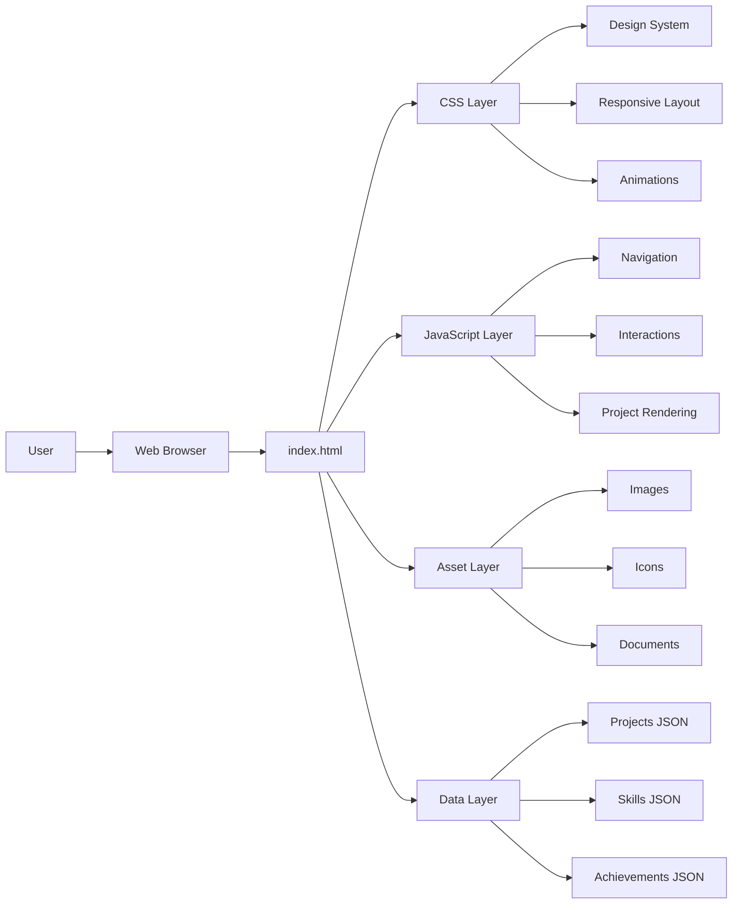
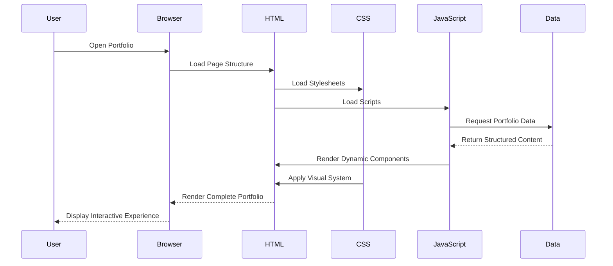
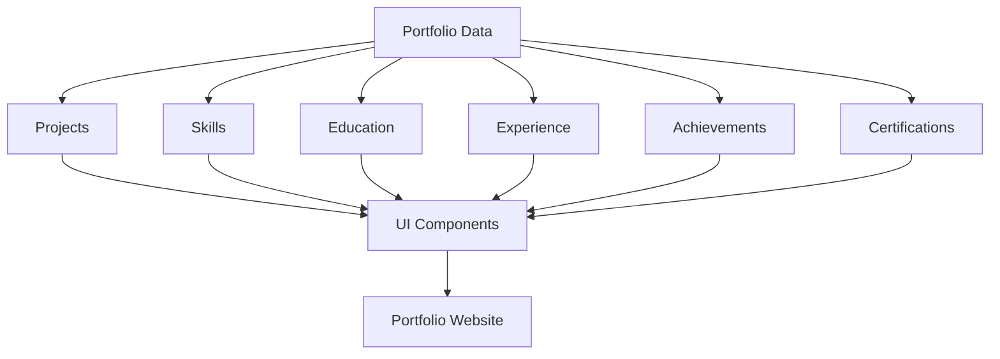
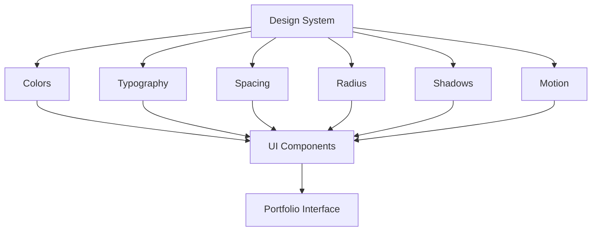
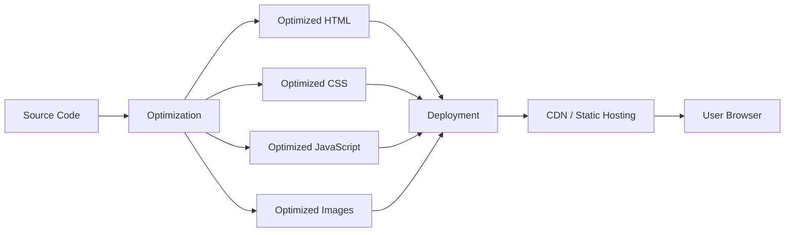
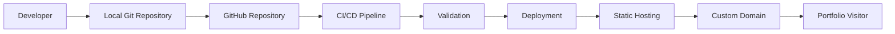
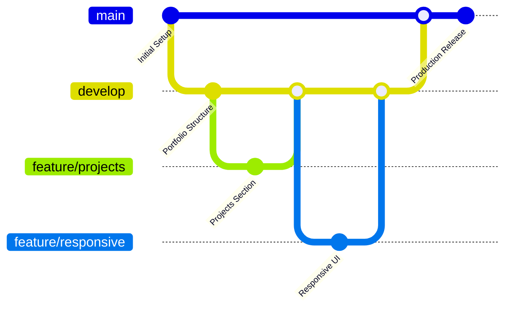
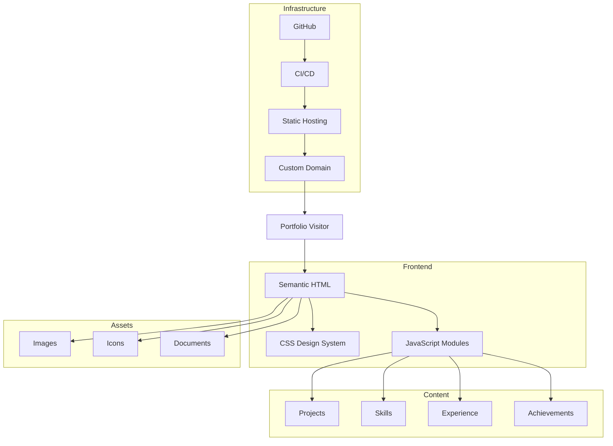

# Rishvin Reddy — Portfolio

> A personal engineering portfolio showcasing my work across Cybersecurity, Internet of Things, Blockchain, Full-Stack Development, Software Engineering, research, and technology projects.

<p align="center">
  <strong>Engineering ideas into secure, connected, and practical systems.</strong>
</p>

<p align="center">
  Portfolio • Projects • Engineering • Research • Achievements • Experience
</p>

---

## Table of Contents

1. [Overview](#overview)
2. [About Me](#about-me)
3. [Portfolio Vision](#portfolio-vision)
4. [Live Website](#live-website)
5. [Repository Overview](#repository-overview)
6. [Technology Stack](#technology-stack)
7. [Core Portfolio Sections](#core-portfolio-sections)
8. [Featured Engineering Domains](#featured-engineering-domains)
9. [System Architecture](#system-architecture)
10. [Application Flow](#application-flow)
11. [Content Architecture](#content-architecture)
12. [Repository Structure](#repository-structure)
13. [Design System](#design-system)
14. [Responsive Design](#responsive-design)
15. [Performance Strategy](#performance-strategy)
16. [Accessibility](#accessibility)
17. [SEO Strategy](#seo-strategy)
18. [Security Considerations](#security-considerations)
19. [Local Development](#local-development)
20. [Deployment](#deployment)
21. [Development Workflow](#development-workflow)
22. [Quality Standards](#quality-standards)
23. [Browser Compatibility](#browser-compatibility)
24. [Roadmap](#roadmap)
25. [Documentation](#documentation)
26. [Contributing](#contributing)
27. [License](#license)
28. [Contact](#contact)

---

# Overview

This repository contains the source code and supporting documentation for my personal portfolio website.

The portfolio serves as a centralized digital representation of my engineering journey, technical capabilities, academic work, projects, achievements, professional development, and long-term areas of interest.

Rather than functioning only as a personal landing page, the portfolio is designed as a structured engineering showcase.

It presents my work across:

- Cybersecurity
- Internet of Things
- Blockchain
- Full-Stack Development
- Software Engineering
- Web Technologies
- Digital Forensics
- Distributed Systems
- Automation
- Technical Research

The website is intentionally designed to remain lightweight, maintainable, responsive, and easy to deploy.

The core implementation uses:

- HTML5
- CSS3
- JavaScript

The architecture avoids unnecessary frontend framework complexity while maintaining a modular project structure and modern engineering practices.

---

# About Me

I am **Erolla Rishvin Reddy**, a B.Tech Computer Science and Engineering student specializing in:

**Blockchain, Internet of Things, and Cybersecurity**

at **Woxsen University**.

My technical interests are centered around building secure, connected, and reliable systems that combine software engineering with emerging technologies.

My primary areas of interest include:

| Domain | Focus |
|---|---|
| Cybersecurity | Application security, network security, secure system design |
| Internet of Things | Connected devices, sensors, embedded systems, IoT architecture |
| Blockchain | Distributed ledgers, smart contracts, decentralized systems |
| Full-Stack Development | Web applications, APIs, frontend and backend systems |
| Digital Forensics | Evidence integrity, forensic workflows, incident investigation |
| Software Engineering | Architecture, modularity, maintainability, development workflows |
| Automation | Workflow automation and engineering productivity |

My long-term objective is to develop strong engineering expertise across security, connected systems, and distributed technologies while building practical projects that solve real-world problems.

---

# Portfolio Vision

The objective of this portfolio is to create a professional digital platform that communicates four things clearly:

### 1. Who I Am

My academic background, engineering interests, technical direction, and professional identity.

### 2. What I Build

A structured showcase of technical projects with clear descriptions of the problems, solutions, architectures, technologies, and outcomes.

### 3. What I Know

My technical skills across programming languages, development tools, cybersecurity, blockchain, IoT, databases, and software engineering.

### 4. How I Think

The architecture, documentation, project decisions, technical workflows, and engineering methodology behind my work.

The portfolio therefore functions as both:

**Personal Brand**

and

**Engineering Documentation Platform**

---

# Live Website

The latest production version of the portfolio is available through the project's configured deployment environment.

> Production portfolio URL:

```text
https://rishvinreddy.vercel.app/
```

Alternative deployment environments may include:

```text
GitHub Pages
Vercel
Custom Domain
```

---

# Repository Overview

The repository follows a modular structure designed to separate:

- Page structure
- Presentation
- Application behavior
- Static assets
- Structured portfolio data
- Engineering documentation

This improves maintainability as the portfolio grows.

```mermaid
flowchart TD

    A[Portfolio Repository]

    A --> B[HTML]
    A --> C[CSS]
    A --> D[JavaScript]
    A --> E[Assets]
    A --> F[Data]
    A --> G[Documentation]
    A --> H[GitHub Automation]

    B --> B1[Page Structure]
    B --> B2[Semantic Content]

    C --> C1[Design System]
    C --> C2[Components]
    C --> C3[Responsive Layout]
    C --> C4[Animations]

    D --> D1[Navigation]
    D --> D2[Interactions]
    D --> D3[Project Rendering]
    D --> D4[UI Behavior]

    E --> E1[Images]
    E --> E2[Icons]
    E --> E3[Fonts]
    E --> E4[Documents]

    F --> F1[Projects]
    F --> F2[Skills]
    F --> F3[Achievements]
    F --> F4[Experience]

    G --> G1[Architecture]
    G --> G2[Design System]
    G --> G3[Development]
    G --> G4[Deployment]

    H --> H1[CI]
    H --> H2[Deployment]
    H --> H3[Quality Checks]
```



---

# Technology Stack

## Core Technologies

| Technology | Purpose |
|---|---|
| HTML5 | Semantic website structure |
| CSS3 | Styling and responsive layouts |
| JavaScript | Interactivity and application behavior |
| JSON | Structured portfolio content |
| Git | Version control |
| GitHub | Repository management |
| GitHub Pages / Vercel | Deployment |

---

## Frontend Architecture

| Layer | Responsibility |
|---|---|
| Structure Layer | Semantic HTML |
| Presentation Layer | CSS design system |
| Interaction Layer | JavaScript |
| Content Layer | JSON and static content |
| Asset Layer | Images, icons, documents |
| Deployment Layer | GitHub Pages or Vercel |
| Documentation Layer | Markdown documentation |

---

# Core Portfolio Sections

The portfolio is organized around several primary content areas.

| Section | Purpose |
|---|---|
| Hero | Introduces personal brand and engineering identity |
| About | Provides academic and professional background |
| Skills | Displays technical capabilities |
| Projects | Showcases engineering work |
| Experience | Presents professional and practical experience |
| Education | Displays academic background |
| Achievements | Highlights accomplishments and recognition |
| Certifications | Presents verified learning milestones |
| Contact | Provides professional communication channels |

---

# Featured Engineering Domains

## Cybersecurity

Projects and learning related to:

- Application security
- Web security
- Network security
- Authentication
- Secure coding
- Vulnerability analysis
- Digital forensics
- Incident investigation

---

## Internet of Things

Engineering work involving:

- ESP32
- Arduino
- Sensors
- MQTT
- Device communication
- Embedded systems
- IoT architecture
- Device security

---

## Blockchain

Work involving:

- Smart contracts
- Ethereum
- Distributed ledgers
- Evidence integrity
- Blockchain-backed systems
- Decentralized architecture

---

## Full-Stack Development

Development experience involving:

- Frontend engineering
- Backend systems
- APIs
- Databases
- Authentication
- Deployment
- Web application architecture

---

# System Architecture

The portfolio uses a lightweight static frontend architecture.



---

# Application Flow



---

# Content Architecture

Portfolio information should be separated from presentation logic whenever practical.



This approach allows portfolio content to be updated without modifying the core layout logic.

---

# Repository Structure

```text
rishvin-reddy-portfolio/
├── src/                # Next.js source code (app, components, lib)
├── public/             # Static assets (images, icons)
├── docs/               # Technical documentation
├── .github/            # GitHub actions and workflows
├── package.json        # Project dependencies and scripts
└── README.md           # Project overview (this file)
```

---

# Design System

The portfolio follows an **Editorial Engineering Luxury** design direction.

The objective is to combine:

- Technical precision
- Premium visual presentation
- Editorial typography
- Clean information hierarchy
- Minimal visual noise
- Strong spacing discipline
- Professional engineering identity

The design should avoid unnecessary visual effects that reduce readability.

---

## Design Principles

| Principle | Implementation |
|---|---|
| Clarity | Clear visual hierarchy |
| Precision | Consistent spacing and alignment |
| Restraint | Limited decorative elements |
| Readability | Strong typography and contrast |
| Responsiveness | Fluid layouts across screen sizes |
| Consistency | Reusable design tokens |
| Performance | Lightweight assets and animations |

---

## Design Token Architecture



---

# Responsive Design

The website is designed using a responsive-first approach.

Primary target categories include:

| Device | Layout Strategy |
|---|---|
| Mobile | Single-column optimized layout |
| Tablet | Adaptive content grid |
| Laptop | Full portfolio experience |
| Desktop | Expanded layout and spacing |
| Large Desktop | Controlled maximum content width |

The responsive system should ensure that:

- Text remains readable.
- Navigation remains accessible.
- Project cards maintain visual hierarchy.
- Images scale correctly.
- Horizontal overflow is prevented.
- Interactive elements maintain adequate touch targets.

---

# Performance Strategy

Performance is an important component of the portfolio architecture.

The project should prioritize:

- Optimized images
- Lazy loading
- Minimal JavaScript
- Efficient CSS
- Reduced render-blocking resources
- Modern image formats
- Browser caching
- Static deployment

---

## Performance Pipeline



---

# Accessibility

The portfolio should follow modern accessibility practices.

Key considerations include:

- Semantic HTML
- Keyboard navigation
- Accessible labels
- Alternative image text
- Sufficient color contrast
- Visible focus states
- Reduced-motion support
- Logical heading hierarchy

Example:

```html

```

Interactive elements should use semantic elements whenever possible.

```html
<button type="button">
  View Project
</button>
```

instead of non-semantic clickable containers.

---

# SEO Strategy

The portfolio should include a structured SEO implementation.

## Core SEO Elements

| Element | Purpose |
|---|---|
| Page Title | Search result identification |
| Meta Description | Search result summary |
| Canonical URL | Prevent duplicate indexing |
| Open Graph | Social sharing previews |
| Twitter Cards | Social media previews |
| Sitemap | Search engine discovery |
| Robots.txt | Crawler configuration |
| Structured Data | Search engine context |

---

## Recommended Metadata

```html
<title>
  Rishvin Reddy | Cybersecurity, IoT & Blockchain Engineer
</title>

<meta
  name="description"
  content="Portfolio of Rishvin Reddy, a Computer Science Engineering student specializing in Cybersecurity, IoT, Blockchain, and Full-Stack Development."
/>
```

---

# Security Considerations

Although the portfolio is primarily a static website, security remains important.

Security principles include:

- No sensitive credentials in frontend code
- No API secrets committed to Git
- HTTPS-only production deployment
- Dependency monitoring where applicable
- Secure external links
- Appropriate Content Security Policy
- Safe handling of contact forms
- No exposed environment variables

Sensitive configuration should never be committed.

Example:

```text
.env
.env.local
.env.production
```

These files should be included in `.gitignore` when applicable.

---

# Local Development

## Prerequisites

A modern browser and a local HTTP server are recommended.

Optional development tools include:

- Visual Studio Code
- Git
- Node.js
- Live Server

---

## Clone Repository

```bash
https://github.com/RishvinReddy/rishvin-reddy-portfolio.git
```

Navigate to the project:

```bash
cd rishvin-reddy-portfolio
```

---

## Run Locally

If using Python:

```bash
python3 -m http.server 8000
```

Open:

```text
localhost:8000
```

Alternatively, use a local development server extension.

---

# Deployment

The portfolio can be deployed using static hosting platforms.

Recommended deployment options:

| Platform | Use Case |
|---|---|
| GitHub Pages | Simple repository-based hosting |
| Vercel | Modern deployment workflow |
| Custom Domain | Professional branding |

---

## Deployment Architecture



---

# Development Workflow

The repository follows a structured Git workflow.



---

## Recommended Branches

| Branch | Purpose |
|---|---|
| `main` | Production-ready portfolio |
| `develop` | Active development |
| `feature/*` | Individual features |
| `fix/*` | Bug fixes |
| `docs/*` | Documentation updates |

For a solo portfolio project, this workflow may be simplified when appropriate.

---

# Quality Standards

Every significant update should be evaluated across five dimensions.

| Area | Requirement |
|---|---|
| Functionality | Features work correctly |
| Responsiveness | Works across screen sizes |
| Accessibility | Core accessibility standards maintained |
| Performance | No unnecessary performance regression |
| Maintainability | Code remains organized and readable |

---

## Pre-Deployment Checklist

- [ ] All navigation links work
- [ ] All project links work
- [ ] Images load correctly
- [ ] Images contain appropriate alt text
- [ ] Mobile navigation works
- [ ] No horizontal overflow
- [ ] No browser console errors
- [ ] Metadata is correct
- [ ] Favicon is configured
- [ ] Open Graph image is configured
- [ ] Sitemap is updated
- [ ] Robots.txt is valid
- [ ] Resume link works
- [ ] GitHub links work
- [ ] LinkedIn links work
- [ ] Contact links work
- [ ] Production deployment is successful

---

# Browser Compatibility

The portfolio targets modern versions of:

- Google Chrome
- Microsoft Edge
- Mozilla Firefox
- Safari

Progressive enhancement should be used where browser-specific features are implemented.

---

# Documentation

Technical documentation is maintained separately from the primary README.

```text
docs/
│
├── ARCHITECTURE.md
├── DESIGN_SYSTEM.md
├── DEVELOPMENT.md
├── DEPLOYMENT.md
├── CONTRIBUTING.md
└── CHANGELOG.md
```

## ARCHITECTURE.md

Documents:

- System architecture
- Frontend architecture
- Data flow
- Module responsibilities
- Technical decisions

## DESIGN_SYSTEM.md

Documents:

- Colors
- Typography
- Spacing
- Components
- Breakpoints
- Animations
- Accessibility

## DEVELOPMENT.md

Documents:

- Local setup
- Development workflow
- File organization
- Coding conventions

## DEPLOYMENT.md

Documents:

- Deployment process
- GitHub Pages configuration
- Vercel configuration
- Custom domain setup

## CHANGELOG.md

Tracks meaningful portfolio releases and improvements.

---

# Lucidchart Architecture

For formal presentations, academic submissions, portfolio case studies, or technical documentation, the following architecture can be recreated in Lucidchart.

## Lucidchart Diagram 1 — Portfolio System Architecture

Create six primary containers:

```text
USER LAYER
    ↓
PRESENTATION LAYER
    ↓
INTERACTION LAYER
    ↓
CONTENT / DATA LAYER
    ↓
ASSET LAYER
    ↓
DEPLOYMENT LAYER
```

### User Layer

```text
Portfolio Visitor
Recruiter
Developer
Faculty / Academic Reviewer
Collaborator
```

### Presentation Layer

```text
HTML5
CSS3
Responsive Layout
Design System
```

### Interaction Layer

```text
JavaScript
Navigation
Animations
Filtering
Dynamic Rendering
```

### Content Layer

```text
Projects
Skills
Experience
Education
Achievements
Certifications
```

### Asset Layer

```text
Images
Icons
Fonts
Resume
Project Screenshots
```

### Deployment Layer

```text
GitHub
CI/CD
Static Hosting
Custom Domain
CDN
```

Connect the layers using directional arrows from the user to the deployment-backed application architecture.

---

## Lucidchart Diagram 2 — Content Management Flow

```text
Developer
    ↓
Portfolio Data
    ↓
JSON Files
    ↓
JavaScript Modules
    ↓
UI Components
    ↓
HTML DOM
    ↓
Rendered Portfolio
    ↓
Visitor
```

This diagram represents the recommended separation between content and presentation.

---

## Lucidchart Diagram 3 — Deployment Workflow

```text
Local Development
        ↓
Git Commit
        ↓
GitHub Repository
        ↓
Automated Validation
        ↓
Deployment Pipeline
        ↓
Production Hosting
        ↓
Custom Domain
        ↓
End User
```

Optional validation branches:

```text
Automated Validation
    ├── HTML Validation
    ├── CSS Validation
    ├── Link Checking
    ├── Performance Check
    └── Accessibility Check
```

---

# Engineering Architecture Summary



---

# Roadmap

## Phase 1 — Foundation

- [x] Repository creation
- [x] Initial portfolio development
- [ ] Repository cleanup
- [ ] Standardized directory architecture
- [ ] Documentation upgrade

## Phase 2 — Portfolio Architecture

- [ ] Modular CSS architecture
- [ ] Modular JavaScript
- [ ] Structured project data
- [ ] Structured achievements data
- [ ] Structured certifications data

## Phase 3 — Design Optimization

- [ ] Finalize design system
- [ ] Improve responsive behavior
- [ ] Optimize whitespace
- [ ] Improve typography
- [ ] Standardize project cards
- [ ] Improve navigation

## Phase 4 — Performance

- [ ] Convert images to modern formats
- [ ] Implement lazy loading
- [ ] Reduce unused CSS
- [ ] Reduce unnecessary JavaScript
- [ ] Optimize fonts
- [ ] Improve Core Web Vitals

## Phase 5 — SEO

- [ ] Add structured metadata
- [ ] Configure Open Graph
- [ ] Configure social previews
- [ ] Add sitemap
- [ ] Configure robots.txt
- [ ] Add structured data

## Phase 6 — Deployment

- [ ] Configure production deployment
- [ ] Configure custom domain
- [ ] Configure HTTPS
- [ ] Validate production build
- [ ] Run Lighthouse audit

## Phase 7 — Continuous Improvement

- [ ] Add new projects
- [ ] Add achievements
- [ ] Add certifications
- [ ] Maintain resume
- [ ] Update technical skills
- [ ] Maintain documentation

---

# Project Philosophy

This portfolio follows a simple engineering principle:

> Build the simplest architecture that can remain professional, scalable, maintainable, and effective.

The portfolio intentionally prioritizes:

```text
Clarity
    +
Performance
    +
Maintainability
    +
Engineering Quality
    +
Professional Presentation
```

over unnecessary technical complexity.

---

# Contributing

This is primarily a personal portfolio repository.

However, suggestions, bug reports, and technical improvements may be submitted through GitHub Issues.

When contributing:

1. Create a dedicated branch.
2. Keep changes focused.
3. Follow the existing code structure.
4. Test responsive behavior.
5. Verify accessibility.
6. Ensure no sensitive information is committed.
7. Submit a clear pull request.

---

# License

The source code licensing terms for this project are defined in the repository's `LICENSE` file.

Personal information, branding assets, photographs, project content, and portfolio-specific materials may remain the intellectual property of their respective owner and should not automatically be considered covered by the source code license.

---

# Contact

**Erolla Rishvin Reddy**

B.Tech Computer Science and Engineering  
Blockchain • Internet of Things • Cybersecurity

### Professional Profiles

- Portfolio: [https://rishvinreddy.vercel.app](https://rishvinreddy.vercel.app)
- GitHub: [https://github.com/RishvinReddy/rishvin-reddy-portfolio.git](https://github.com/RishvinReddy/rishvin-reddy-portfolio.git)
- LinkedIn: [https://linkedin.com/in/rishvinreddy](https://linkedin.com/in/rishvinreddy)

---

<p align="center">
  <strong>Designed and engineered by Rishvin Reddy.</strong>
</p>

<p align="center">
  Cybersecurity • IoT • Blockchain • Full-Stack Development
</p>