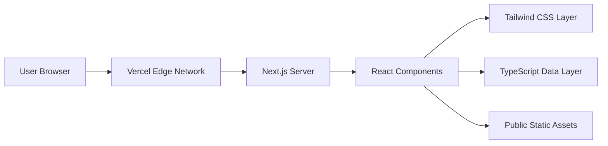
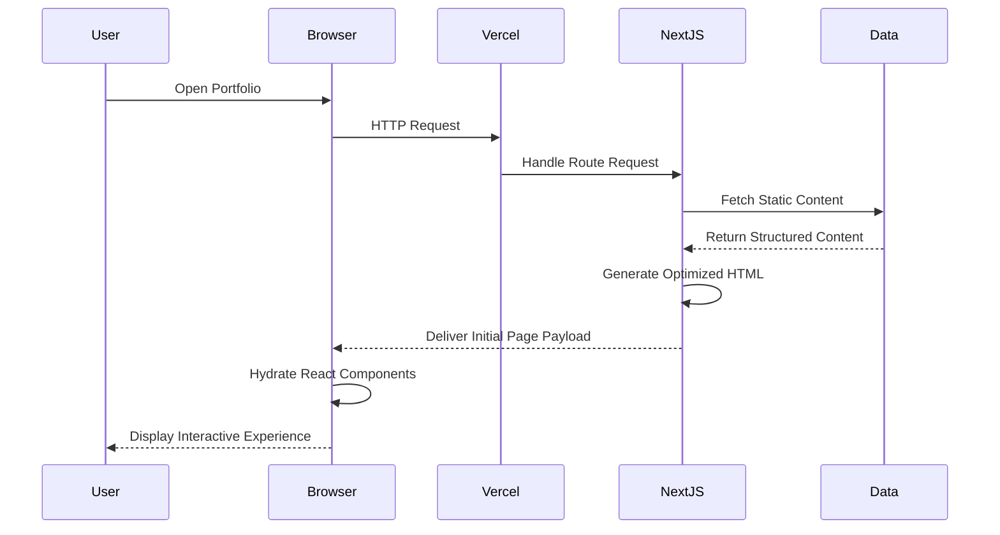
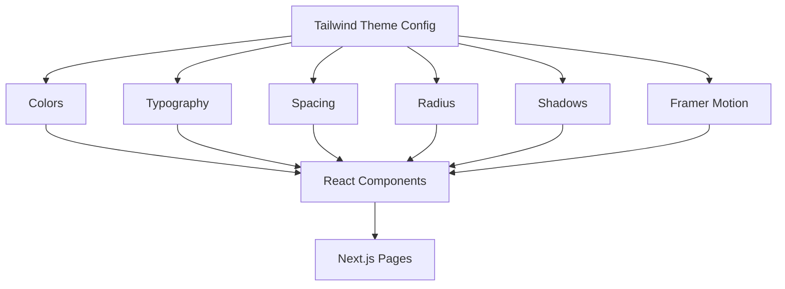
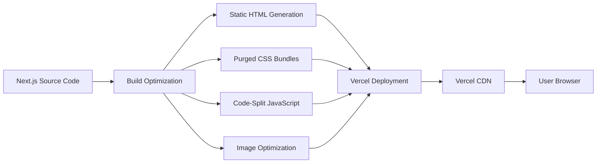
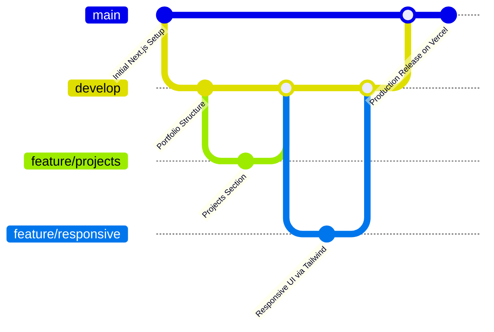
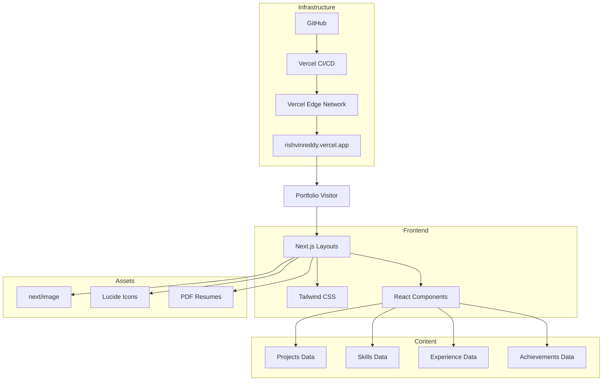

# Rishvin Reddy — Portfolio

A personal engineering portfolio showcasing my work across Cybersecurity, Internet of Things, Blockchain, Full-Stack Development, Software Engineering, research, and technology projects.

<p align="center">
  <strong>Engineering ideas into secure, connected, and practical systems.</strong>
</p>
<p align="center">
  Portfolio • Projects • Engineering • Research • Achievements • Experience
</p>

⸻

## Table of Contents

1. [Overview](#overview)
2. [About Me](#about-me)
3. [Portfolio Vision](#portfolio-vision)
4. [Live Website](#live-website)
5. [Repository Overview](#repository-overview)
6. [Technology Stack](#technology-stack)
7. [Core Portfolio Sections](#core-portfolio-sections)
8. [Featured Engineering Domains](#featured-engineering-domains)
9. [System Architecture](#system-architecture)
10. [Application Flow](#application-flow)
11. [Content Architecture](#content-architecture)
12. [Repository Structure](#repository-structure)
13. [Design System](#design-system)
14. [Responsive Design](#responsive-design)
15. [Performance Strategy](#performance-strategy)
16. [Accessibility](#accessibility)
17. [SEO Strategy](#seo-strategy)
18. [Security Considerations](#security-considerations)
19. [Local Development](#local-development)
20. [Deployment](#deployment)
21. [Development Workflow](#development-workflow)
22. [Quality Standards](#quality-standards)
23. [Browser Compatibility](#browser-compatibility)
24. [Roadmap](#roadmap)
25. [Documentation](#documentation)
26. [Contributing](#contributing)
27. [License](#license)
28. [Contact](#contact)

⸻

## Overview

This repository contains the source code and supporting documentation for my personal portfolio website.

The portfolio serves as a centralized digital representation of my engineering journey, technical capabilities, academic work, projects, achievements, professional development, and long-term areas of interest.

Rather than functioning only as a personal landing page, the portfolio is designed as a structured engineering showcase.

It presents my work across:

* Cybersecurity
* Internet of Things
* Blockchain
* Full-Stack Development
* Software Engineering
* Web Technologies
* Digital Forensics
* Distributed Systems
* Automation
* Technical Research

The website is intentionally designed to remain lightweight, maintainable, responsive, and easy to deploy.

The core implementation uses a modern web stack:

* Next.js (App Router)
* React & TypeScript
* Tailwind CSS
* Framer Motion

The architecture avoids unnecessary frontend framework complexity while maintaining a modular project structure and modern engineering practices.

⸻

## About Me

I am Erolla Rishvin Reddy, a B.Tech Computer Science and Engineering student specializing in:

**Blockchain, Internet of Things, and Cybersecurity**

at Woxsen University.

My technical interests are centered around building secure, connected, and reliable systems that combine software engineering with emerging technologies.

My primary areas of interest include:

| Domain | Focus |
|--------|-------|
| **Cybersecurity** | Application security, network security, secure system design |
| **Internet of Things** | Connected devices, sensors, embedded systems, IoT architecture |
| **Blockchain** | Distributed ledgers, smart contracts, decentralized systems |
| **Full-Stack Development** | Web applications, APIs, frontend and backend systems |
| **Digital Forensics** | Evidence integrity, forensic workflows, incident investigation |
| **Software Engineering** | Architecture, modularity, maintainability, development workflows |
| **Automation** | Workflow automation and engineering productivity |

My long-term objective is to develop strong engineering expertise across security, connected systems, and distributed technologies while building practical projects that solve real-world problems.

⸻

## Portfolio Vision

The objective of this portfolio is to create a professional digital platform that communicates four things clearly:

1. **Who I Am**  
My academic background, engineering interests, technical direction, and professional identity.

2. **What I Build**  
A structured showcase of technical projects with clear descriptions of the problems, solutions, architectures, technologies, and outcomes.

3. **What I Know**  
My technical skills across programming languages, development tools, cybersecurity, blockchain, IoT, databases, and software engineering.

4. **How I Think**  
The architecture, documentation, project decisions, technical workflows, and engineering methodology behind my work.

The portfolio therefore functions as both:

**Personal Brand**  
and  
**Engineering Documentation Platform**

⸻

## Live Website

The latest production version of the portfolio is available through the project’s configured deployment environment.

**Production Portfolio URL:**  
https://rishvinreddy.vercel.app/

Primary deployment environment:  
**Vercel**

⸻

## Repository Overview

The repository follows a modular structure designed to separate:

* Page structure (Next.js App Router)
* Presentation (Tailwind CSS)
* Application behavior (React)
* Static assets
* Structured portfolio data (TypeScript)
* Engineering documentation

This improves maintainability as the portfolio grows.

```mermaid
flowchart TD
    A[Portfolio Repository]
    A --> B[Next.js App Router]
    A --> C[Tailwind CSS]
    A --> D[React Components]
    A --> E[Public Assets]
    A --> F[TypeScript Data]
    A --> G[Documentation]
    A --> H[GitHub Automation]
    
    B --> B1[Page Structure]
    B --> B2[Semantic Layouts]
    C --> C1[Design Tokens]
    C --> C2[Component Styling]
    C --> C3[Responsive Layout]
    C --> C4[Framer Motion Animations]
    D --> D1[Navigation]
    D --> D2[Interactions]
    D --> D3[Project Rendering]
    D --> D4[UI Behavior]
    E --> E1[Images]
    E --> E2[Icons]
    E --> E3[Fonts]
    E --> E4[Documents & Resumes]
    F --> F1[Projects Data]
    F --> F2[Skills Data]
    F --> F3[Achievements Data]
    F --> F4[Experience Data]
    G --> G1[Architecture]
    G --> G2[Design System]
    G --> G3[Development]
    G --> G4[Deployment]
    H --> H1[CI / Linting]
    H --> H2[Vercel Deployment]
    H --> H3[Quality Checks]
```



⸻

## Technology Stack

### Core Technologies

| Technology | Purpose |
|------------|---------|
| Next.js 15 | Application structure, routing, and SSR |
| React 19 | Component architecture and UI logic |
| TypeScript | Static typing and robust data structures |
| Tailwind CSS v4 | Utility-first styling and responsive layouts |
| Framer Motion | Fluid animations and interactive elements |
| GitHub | Repository management and version control |
| Vercel | Automated CI/CD and edge hosting |

⸻

### Frontend Architecture

| Layer | Responsibility |
|-------|----------------|
| Structure Layer | Semantic HTML within Next.js Layouts |
| Presentation Layer | Tailwind CSS design system |
| Interaction Layer | React Hooks and Framer Motion |
| Content Layer | Static TypeScript data modules (`src/data`) |
| Asset Layer | Images, icons, and documents (`public/`) |
| Deployment Layer | Vercel Edge Network |
| Documentation Layer | Markdown documentation (`docs/`) |

⸻

## Core Portfolio Sections

The portfolio is organized around several primary content areas.

| Section | Purpose |
|---------|---------|
| Hero | Introduces personal brand and engineering identity |
| About | Provides academic and professional background |
| Skills | Displays technical capabilities |
| Projects | Showcases engineering work |
| Experience | Presents professional and practical experience |
| Education | Displays academic background |
| Achievements | Highlights accomplishments and recognition |
| Certifications | Presents verified learning milestones |
| Contact | Provides professional communication channels |

⸻

## Featured Engineering Domains

### Cybersecurity
Projects and learning related to:
* Application security
* Web security
* Network security
* Authentication
* Secure coding
* Vulnerability analysis
* Digital forensics
* Incident investigation

### Internet of Things
Engineering work involving:
* ESP32
* Arduino
* Sensors
* MQTT
* Device communication
* Embedded systems
* IoT architecture
* Device security

### Blockchain
Work involving:
* Smart contracts
* Ethereum
* Distributed ledgers
* Evidence integrity
* Blockchain-backed systems
* Decentralized architecture

### Full-Stack Development
Development experience involving:
* Frontend engineering (React/Next.js)
* Backend systems
* APIs
* Databases
* Authentication
* Deployment
* Web application architecture

⸻

## System Architecture

The portfolio uses a modern, React-based server-rendered architecture.



⸻

## Application Flow



⸻

## Content Architecture

Portfolio information is separated from presentation logic using typed data modules.

```mermaid
flowchart TD
    DATA[src/data/]
    DATA --> PROJECTS[portfolio.ts (Projects)]
    DATA --> SKILLS[portfolio.ts (Skills)]
    DATA --> EDUCATION[portfolio.ts (Education)]
    DATA --> EXPERIENCE[portfolio.ts (Experience)]
    DATA --> ACHIEVEMENTS[portfolio.ts (Awards)]
    
    PROJECTS --> UI[React UI Components]
    SKILLS --> UI
    EDUCATION --> UI
    EXPERIENCE --> UI
    ACHIEVEMENTS --> UI
    
    UI --> PORTFOLIO[Next.js App Router Pages]
```

This approach allows portfolio content to be updated without modifying the core layout logic.

⸻

## Repository Structure

```text
rishvin-reddy-portfolio/
│
├── .github/
│   ├── ISSUE_TEMPLATE/
│   ├── PULL_REQUEST_TEMPLATE.md
│   └── workflows/
│
├── public/
│   ├── assets/
│   │   ├── certificates/
│   │   └── ...
│   ├── resumes/
│   ├── favicon.ico
│   └── next.svg
│
├── src/
│   ├── app/                 # Next.js Routes
│   │   ├── about/
│   │   ├── portfolio/
│   │   ├── layout.tsx
│   │   └── page.tsx
│   ├── components/          # React Components
│   │   ├── ui/
│   │   ├── Header.tsx
│   │   └── Footer.tsx
│   ├── data/                # Content Modules
│   │   └── portfolio.ts
│   └── lib/                 # Utilities
│       └── utils.ts
│
├── docs/
│   ├── ARCHITECTURE.md
│   ├── DESIGN_SYSTEM.md
│   ├── DEVELOPMENT.md
│   ├── DEPLOYMENT.md
│   ├── CONTRIBUTING.md
│   ├── SEO.md
│   └── PERFORMANCE.md
│
├── next.config.ts
├── tailwind.config.ts
├── tsconfig.json
├── package.json
├── CHANGELOG.md
├── SECURITY.md
├── LICENSE
└── README.md
```

⸻

## Design System

The portfolio follows an Editorial Engineering Luxury design direction.

The objective is to combine:
* Technical precision
* Premium visual presentation
* Editorial typography
* Clean information hierarchy
* Minimal visual noise
* Strong spacing discipline
* Professional engineering identity

The design avoids unnecessary visual effects that reduce readability, powered by Tailwind CSS.

⸻

### Design Principles

| Principle | Implementation |
|-----------|----------------|
| **Clarity** | Clear visual hierarchy using semantic HTML |
| **Precision** | Consistent spacing and alignment via Tailwind |
| **Restraint** | Limited decorative elements |
| **Readability** | Strong typography and contrast |
| **Responsiveness** | Fluid layouts across screen sizes |
| **Consistency** | Reusable Tailwind configuration tokens |
| **Performance** | Lightweight assets and Framer animations |

⸻

### Design Token Architecture



⸻

## Responsive Design

The website is designed using a responsive-first approach utilizing Tailwind breakpoints.

Primary target categories include:

| Device | Layout Strategy |
|--------|-----------------|
| **Mobile (`sm`)** | Single-column optimized layout |
| **Tablet (`md`)** | Adaptive content grid |
| **Laptop (`lg`)** | Full portfolio experience |
| **Desktop (`xl`)** | Expanded layout and spacing |
| **Large Desktop (`2xl`)** | Controlled maximum content width (`max-w-7xl`) |

The responsive system ensures that:
* Text remains readable.
* Navigation remains accessible.
* Project cards maintain visual hierarchy.
* Images scale correctly (using `next/image`).
* Horizontal overflow is prevented.
* Interactive elements maintain adequate touch targets.

⸻

## Performance Strategy

Performance is an important component of the portfolio architecture.

The project prioritizes:
* Optimized images (WebP/AVIF via `next/image`)
* Next.js static generation (SSG)
* Minimal client-side JavaScript payloads
* Efficient CSS (Tailwind purging)
* Reduced render-blocking resources
* Vercel Edge caching

⸻

### Performance Pipeline



⸻

## Accessibility

The portfolio follows modern accessibility practices.

Key considerations include:
* Semantic HTML
* Keyboard navigation
* Accessible labels (`aria-label`)
* Alternative image text (`alt`)
* Sufficient color contrast
* Visible focus states
* Logical heading hierarchy

Interactive elements use semantic elements whenever possible, leveraging Radix UI primitives where necessary for robust accessibility.

⸻

## SEO Strategy

The portfolio includes a structured SEO implementation powered by the Next.js Metadata API.

### Core SEO Elements

| Element | Purpose |
|---------|---------|
| **Page Title** | Search result identification |
| **Meta Description** | Search result summary |
| **Canonical URL** | Prevent duplicate indexing |
| **Open Graph** | Social sharing previews |
| **Twitter Cards** | Social media previews |
| **Sitemap** | Search engine discovery (`sitemap.ts`) |
| **Robots.txt** | Crawler configuration (`robots.ts`) |
| **Google Verification** | Search Console ownership validation |

⸻

### Configured Metadata

```typescript
export const metadata: Metadata = {
  title: "Rishvin Reddy | Software Engineering, Cybersecurity, IoT & Blockchain",
  description: "Official portfolio of Erolla Rishvin Reddy, a B.Tech CSE student at Woxsen University specializing in Blockchain, IoT and Cybersecurity.",
  verification: {
    google: "gqSeJRumXVEo6URkxbldpICOXZ9OBRZ3gs-B-9Wu-4k",
  },
};
```

⸻

## Security Considerations

Although the portfolio is primarily a static website, security remains important.

Security principles include:
* No sensitive credentials in frontend code
* No API secrets committed to Git
* HTTPS-only production deployment
* Dependency monitoring (`npm audit`)
* Secure external links (`rel="noopener noreferrer"`)
* No exposed environment variables

Sensitive configuration should never be committed:
```text
.env
.env.local
.env.production
```
These files are included in `.gitignore`.

⸻

## Local Development

### Prerequisites
A modern browser and **Node.js (v18+)** are recommended.

Optional development tools include:
* Visual Studio Code
* Git

⸻

### Clone Repository

```bash
git clone https://github.com/RishvinReddy/Vercel-Portfolio-Test.git
```

Navigate to the project:
```bash
cd Vercel-Portfolio-Test
```

⸻

### Run Locally

Install dependencies:
```bash
npm install
```

Start the Next.js development server:
```bash
npm run dev
```

Open:
`http://localhost:3000`

⸻

## Deployment

The portfolio can be deployed using static hosting platforms.

Recommended deployment options:

| Platform | Use Case |
|----------|----------|
| **Vercel** | Modern Next.js deployment workflow (Primary) |
| **GitHub Pages** | Static export alternative (`next export`) |
| **Custom Domain** | Professional branding |

⸻

### Deployment Architecture

```mermaid
flowchart LR
    DEV[Developer]
    DEV --> GIT[Local Git Repository]
    GIT --> GH[GitHub Repository]
    GH --> CI[Vercel CI/CD Pipeline]
    CI --> BUILD[Next.js Build & Validate]
    BUILD --> DEPLOY[Edge Deployment]
    DEPLOY --> HOST[Vercel Static Hosting]
    HOST --> DOMAIN[rishvinreddy.vercel.app]
    DOMAIN --> USER[Portfolio Visitor]
```



⸻

## Development Workflow

The repository follows a structured Git workflow.



⸻

### Recommended Branches

| Branch | Purpose |
|--------|---------|
| `main` | Production-ready portfolio |
| `develop` | Active development |
| `feature/*` | Individual features |
| `fix/*` | Bug fixes |
| `docs/*` | Documentation updates |

For a solo portfolio project, this workflow is simplified to direct `main` commits where appropriate.

⸻

## Quality Standards

Every significant update should be evaluated across five dimensions.

| Area | Requirement |
|------|-------------|
| **Functionality** | Features work correctly (React state, routing) |
| **Responsiveness** | Works seamlessly across all Tailwind screen sizes |
| **Accessibility** | Core accessibility standards maintained |
| **Performance** | Next.js build shows optimal bundle sizes |
| **Maintainability** | TypeScript code remains organized and readable |

⸻

## Pre-Deployment Checklist

* All navigation links work
* All project links work
* Images load correctly via `next/image`
* Images contain appropriate alt text
* Mobile navigation works
* No horizontal overflow
* No browser console errors
* Next.js Metadata is correct
* Favicon is configured
* Open Graph image is configured
* Sitemap is updated
* Robots.txt is valid
* Resume link works
* GitHub & LinkedIn links work
* Vercel deployment completes successfully

⸻

## Browser Compatibility

The portfolio targets modern versions of:
* Google Chrome
* Microsoft Edge
* Mozilla Firefox
* Safari

Progressive enhancement is used where browser-specific features are implemented.

⸻

## Documentation

Technical documentation is maintained separately from the primary README in the `docs/` directory.

```text
docs/
│
├── ARCHITECTURE.md
├── DESIGN_SYSTEM.md
├── DEVELOPMENT.md
├── DEPLOYMENT.md
├── SEO.md
├── PERFORMANCE.md
└── CONTRIBUTING.md
```

### ARCHITECTURE.md
Documents System architecture, Next.js frontend architecture, Data flow, and Module responsibilities.

### DESIGN_SYSTEM.md
Documents Tailwind Colors, Typography, Spacing, Components, Breakpoints, and Framer Motion Animations.

### DEVELOPMENT.md
Documents Local setup, Development workflow, File organization, and TypeScript conventions.

### DEPLOYMENT.md
Documents Deployment process, Vercel configuration, and Custom domain setup.

### CHANGELOG.md
Tracks meaningful portfolio releases and improvements in the root directory.

⸻

## Engineering Architecture Summary



⸻

## Roadmap

### Phase 1 — Foundation
* [x] Repository creation & Next.js initialization
* [x] Initial portfolio development
* [x] Standardized directory architecture
* [x] Documentation upgrade

### Phase 2 — Portfolio Architecture
* [x] Tailwind CSS architecture
* [x] React Component architecture
* [x] Structured project data in TypeScript
* [x] Structured achievements & certifications data

### Phase 3 — Design Optimization
* [x] Finalize design system
* [x] Improve responsive behavior
* [x] Optimize whitespace
* [x] Standardize project cards
* [x] Integrate Framer Motion animations

### Phase 4 — Performance
* [x] Convert images to modern formats (`next/image`)
* [x] Implement lazy loading
* [x] Reduce unused CSS (Tailwind purging)
* [x] Optimize fonts (`next/font`)
* [ ] Run Lighthouse audit

### Phase 5 — SEO
* [x] Add Next.js structured metadata
* [x] Configure Open Graph previews
* [x] Generate sitemap (`sitemap.ts`)
* [x] Configure `robots.ts`
* [x] Google Search Console verification

### Phase 6 — Deployment
* [x] Configure Vercel production deployment
* [x] Validate production build
* [ ] Configure custom domain

### Phase 7 — Continuous Improvement
* [ ] Add new projects
* [ ] Add latest achievements
* [ ] Maintain resume
* [ ] Update technical skills

⸻

## Project Philosophy

This portfolio follows a simple engineering principle:

**Build the simplest architecture that can remain professional, scalable, maintainable, and effective.**

The portfolio intentionally prioritizes:

`Clarity` + `Performance` + `Maintainability` + `Engineering Quality` + `Professional Presentation`

over unnecessary technical complexity.

⸻

## Contributing

This is primarily a personal portfolio repository.

However, suggestions, bug reports, and technical improvements may be submitted through GitHub Issues.

When contributing:
1. Create a dedicated branch.
2. Keep changes focused.
3. Follow the existing codebase conventions (Next.js/React).
4. Test responsive behavior.
5. Verify accessibility.
6. Ensure no sensitive information is committed.
7. Submit a clear pull request.

⸻

## License

The source code licensing terms for this project are defined in the repository’s `LICENSE` file.

*Personal information, branding assets, photographs, project content, and portfolio-specific materials remain the intellectual property of Erolla Rishvin Reddy and are not automatically covered by the source code license.*

⸻

## Contact

**Erolla Rishvin Reddy**

B.Tech Computer Science and Engineering  
Blockchain • Internet of Things • Cybersecurity

### Professional Profiles
* **Portfolio:** [rishvinreddy.vercel.app](https://rishvinreddy.vercel.app/)
* **GitHub:** [github.com/RishvinReddy](https://github.com/RishvinReddy)
* **LinkedIn:** [linkedin.com/in/rishvinreddy](https://www.linkedin.com/in/rishvinreddy)

⸻

<p align="center">
  <strong>Designed and engineered by Rishvin Reddy.</strong>
</p>
<p align="center">
  Cybersecurity • IoT • Blockchain • Full-Stack Development
</p>
