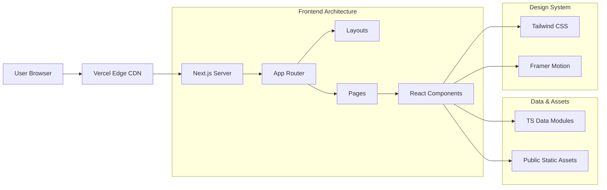
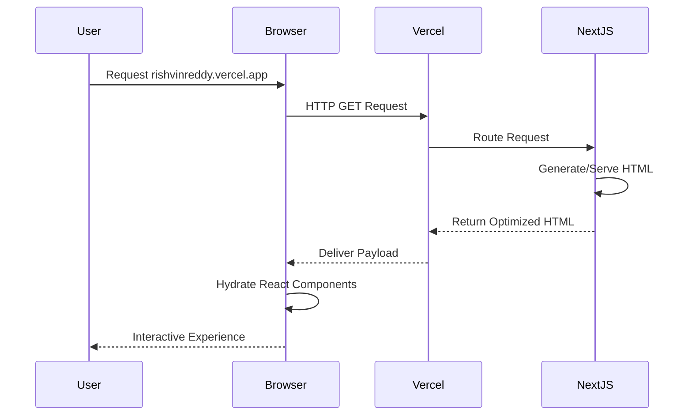
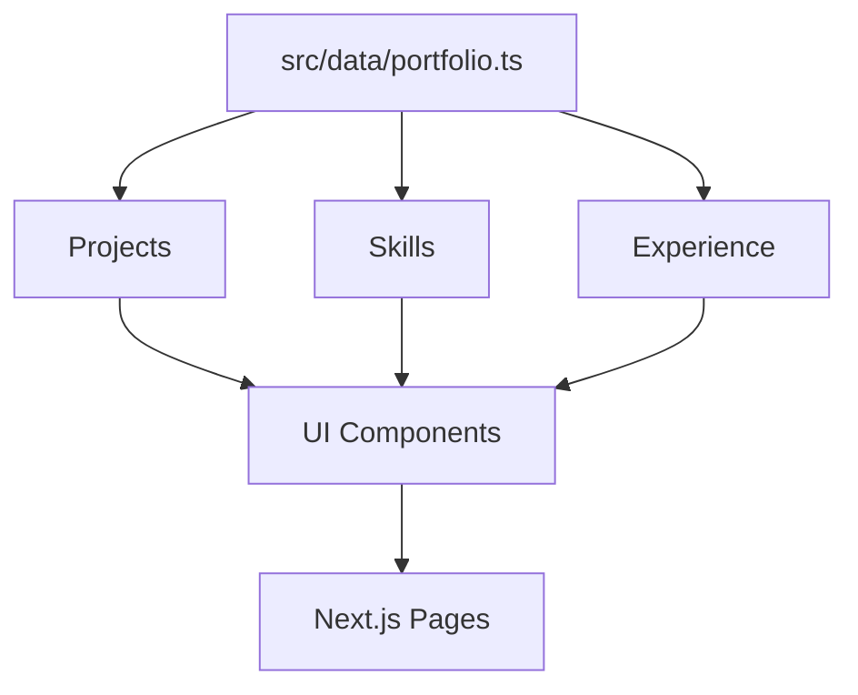

# Portfolio System Architecture

This document outlines the technical architecture of the personal portfolio website. 

## System Architecture

The portfolio uses a modern, server-rendered React architecture powered by Next.js.

## Application Flow

## Content Architecture

Portfolio information is separated from presentation logic using static TypeScript data files (e.g., `src/data/portfolio.ts`).

